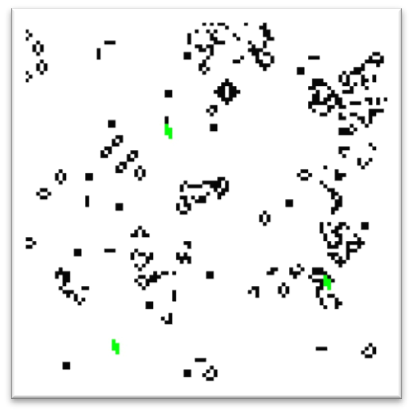

# Conways Game of Life (4 Punkte)

## Kurzbeschreibung 

Zu erstellen ist ein Python Programm, in dem der Game of Life Algorithmus abläuft, während drei Turtles in der Turtle-Bewegung aufeinander zulaufen. Die Turtles beeinflussen hierbei den Game of Life Algorithmus, werden allerdings selbst nicht von diesem beeinflusst.

## Algorithmus

Zu verwenden ist der [erste Regelentwurf von Conway](https://en.wikipedia.org/wiki/Conway's_Game_of_Life). 
Der initiale Zustand des Spielbretts (Generation 0 / Spielstart) soll durch eine zufällige Verteilung der Zustände 'tot' und 'lebendig' generiert werden. Dabei muss die Wahrscheinlichkeit für die beiden Zustände vor Programmstart im Code einstellbar sein.
Die Größe des Spielfeldes muss ebenfalls vor Programmstart im Code einstellbar sein, darf aber von Ihnen gewählten Regeln unterliegen (zum Beispiel: Anzahl Zellen muss Quadratzahl sein). Nach Start des Programms darf das Spiel ohne weitere Interaktionsmöglichkeiten durch den Nutzer ablaufen (Sie dürfen natürlich Interaktionsmöglichkeiten einbauen, wenn Sie möchten).



## Turtles

Es sind drei Turtle zu erstellen, die in der klassischen Turtle-Bewegung aufeinander zulaufen (siehe Unterlagen in meinFBM). Die Turtle sollen an den drei Ecken eines imaginären gleichseitigen Dreiecks in Spielfeldrandnähe starten. Die zurückgelegte Strecke pro Schritt soll variabel einstellbar sein (im Code vor Start des Programms). Die Zeit zwischen zwei Schritten darf frei gewählt werden (in Abhängigkeit der Frames oder fest in Sekunden), muss aber geringer als die Framerate des Game of Life Algorithmus sein (also nicht: ein Schritt pro Frame). Welche Form die Turtle haben, ist ebenfalls frei zu wählen (Beispielsweise: Block aus 3x3 Zellen, oder Turtle-Oszillator), muss allerdings größer als eine Zelle sein. Die Turtle stellen hierbei eine Gruppe aus Zellen dar, die vom Game of Life Algorithmus als lebende Zellen interpretiert werden. Die Turtle selbst dürfen allerdings niemals in ihrer Form beeinflusst werden (Ausnahme: wenn Sie einen Oszillator als Turtle wählen, darf dieser natürlich oszillieren, allerdings nicht durch andere lebende oder tote Zellen in seiner Umgebung beeinflusst werden). Stellen Sie die Turtle jeweils an der nächst möglichen Position im Raster des Game of Life Algorithmus dar. Eine “springende” Bewegung der Turtle wird akzeptiert. Die Turtle sollen farblich von “normalen” lebenden Zellen unterscheidbar sein (und zwar nur die Turtle an ihrer aktuellen Position). Lässt man das Programm lange genug laufen, sollen sich die Turtle im Mittelpunkt der Zeichenfläche oder im Mittelpunkt des anfangs zentrierten gleichseitigen Dreiecks treffen und dort verweilen (ergibt sich durch korrekt programmierte Turtle-Bewegung automatisch; beachten Sie, dass der Mittelpunkt eines gleichseitigen Dreiecks nicht auf der halben Höhe des Dreiecks liegt - ein vom Mittelpunkt der Zeichenfläche nach unten abweichender Treffpunkt der Turtle ist also auch korrekt).

## Hinweis zur Visualisierung mit Matplotlib

Die simpelste und gebräuchlichste Bibliothek zur Visualisierung in Python ist `matplotlib`.
Matplotlib ist allerdings eher für die statische Visualisierung von Daten gedacht, weshalb das Updaten eines Frames relativ umständlich und inperformant ist. (Dennoch sei an dieser Stelle vermerkt: Sollten Sie eine sehr niedrige Framerate haben (z.B. 5 fps) versuchen Sie zunächst ihren Code zu optimieren.) Deshalb hier der Code, um dies dennoch schnell bewerkstelligen zu können. Alternativ können auch performantere Bibliotheken (z.B. PyQtGraph) verwendet werden.

**ACHTUNG: Dieser Code funktioniert nicht mit dem Scientific Mode der PyCharm-Professional Version!**
In der Community Edition tritt dies nicht auf. In der Professional Edition muss unter `File >> Settings... >> Tools >> Python Scientific >> Show plots in tool window` der Haken entfernt werden.

```python
import time

import numpy as np
from scipy import ndimage
import matplotlib.pyplot as plt


def random_frame():
    return np.random.choice((0, 1), (100, 100))


if __name__ == '__main__':
    # create initial frame
    frame = random_frame()

    # set up plot window
    plt.ion()  # interactive mode on
    fig = plt.figure()  # get figure
    plot = plt.imshow(frame, cmap='gray_r')  # show window with initial frame

    while True:  # keep updating plot until aborted
        frame = random_frame()  # next frame
        plot.set_data(frame)  # update plot's data
        plt.draw()  # redraw plot
        fig.canvas.flush_events()
        time.sleep(1)  # wait 1s
```

## Abgabe

Die Abgabe erfolgt in Form einer Kurzpräsentation am Ende der FMA-Übungen. Bestehen Sie bei einem Abgabetermin nicht, können Sie bei der nächsten Übung erneut eine Lösung einreichen. Bei der Kurzpräsentation sollen Sie Ihr Ergebnis vorzeigen und kurz erklären, wie Sie zu Ihrer Lösung gekommen sind. Durch kurze Nachfragen wird überprüft, ob Sie Ihre Arbeit selbst erstellt und verstanden haben. Bestehender Code (wie in der Vorlesung präsentiert) darf verwendet werden, Sie müssen diesen jedoch vollständig verstanden haben. Wurde die Aufgabe korrekt und vollständig erfüllt, gibt es die oben genannte Anzahl an Punkten. Es werden keine Teilpunkte vergeben: die Aufgabe wurde entweder bestanden oder nicht.