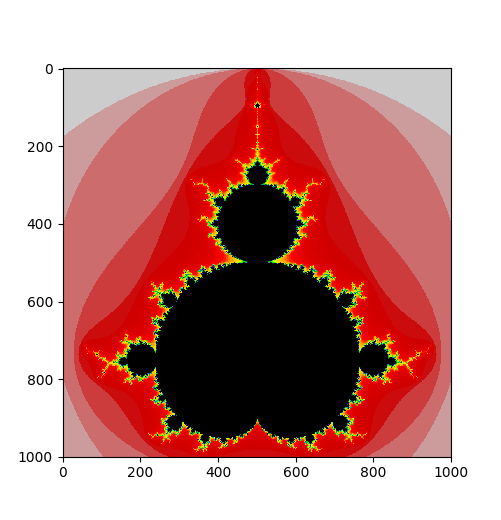

# Mandelbrot-Menge (2? Punkte)

## Kurzbeschreibung

Es soll ein Programm in Python erstellt werden, das die Mandelbrot-Menge darstellt. Für das Programm dürfen Sie die Einfärbung frei, allerdings eindeutig wählen (die Menge muss erkennbar sein). In meinFBM gibt es einen Guide, der Sie bei der Erstellung Ihres Programms unterstützt.

## Mandelbrotmenge

Zu erstellen ist ein Python Programm, das die Mandelbrotmenge darstellt. Der aktuelle Ausschnitt der Mandelbrotmenge soll per Kommandozeileneingabe nach jedem Plot neu gewählt werden können (siehe `input()` Funktion).
Gute Startwerte sind beispielsweise `(-2.0, 0.5, -1.25, 1.25)` für `(x_min, x_max, y_min, y_max)`.
Die Werte für den aktuell gewählten Ausschnitt sollen im angezeigten Plot erkennbar sein - entweder anhand der Achsenbeschriftung, oder anhand der Überschrift des Plots.

## Abgabe

Die Abgabe erfolgt in Form einer Kurzpräsentation am Ende der FMA-Übungen. Bestehen Sie bei einem Abgabetermin nicht, können Sie bei der nächsten Übung erneut eine Lösung einreichen. Bei der Kurzpräsentation sollen Sie Ihr Ergebnis vorzeigen und kurz erklären, wie Sie zu Ihrer Lösung gekommen sind. Durch kurze Nachfragen wird überprüft, ob Sie Ihre Arbeit selbst erstellt und verstanden haben. Bestehender Code (wie in der Vorlesung präsentiert) darf verwendet werden, Sie müssen diesen jedoch vollständig verstanden haben. Wurde die Aufgabe korrekt und vollständig erfüllt, gibt es die oben genannte Anzahl an Punkten. Es werden keine Teilpunkte vergeben: die Aufgabe wurde entweder bestanden oder nicht.