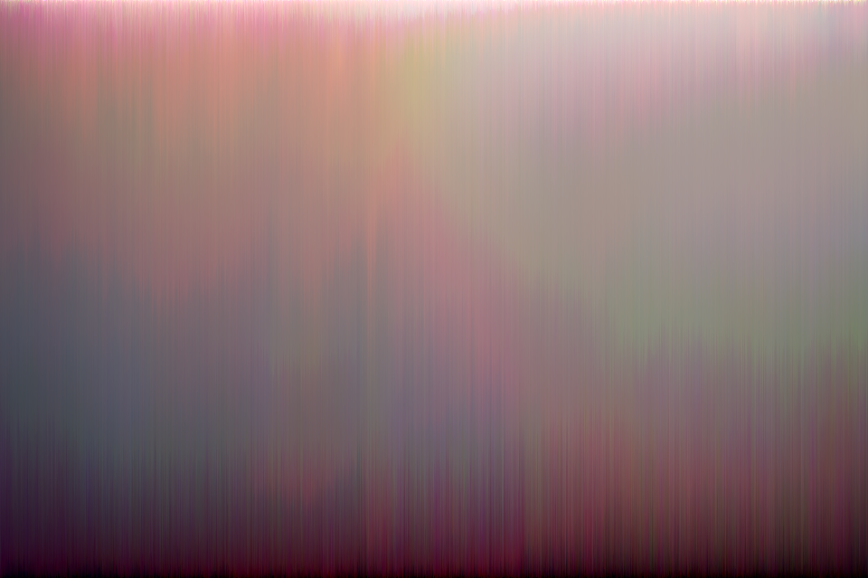

# Picture-Sort  (2? Punkte)

## Kurzbeschreibung

Erstellen Sie ein Python Programm, das die Pixel eines beliebigen Bildes sortiert.

## Sortieren

In dieser Aufgabe soll ein Bild sortiert werden. Nehmen Sie als Quelle ein beliebiges Bild und sortieren Sie es:
1. Zeilenweise

2. Spaltenweise

3. Kontinuierlich

| Original                               | Zeilenweise                              |
| -------------------------------------- | ---------------------------------------- |
|  |  |
| Spaltenweise                           | Kontinuierlich                           |
|  |  |

Wählen Sie hierbei selbst ein Sortierkriterium. Vorschläge für Sortierkriteria: Lumineszenz, Farbkanäle R,G,B getrennt voneinander sortiert und anschließend wieder zusammen gesetzt, Abstände im Lab-Farbraum, Delta E im xyY Farbraum des [CIE-Normvalenzsystems](https://de.wikipedia.org/wiki/CIE-Normvalenzsystem).

Wählen Sie für die Sortierung einen fortgeschrittenen Sortieralgorithmus wie Quicksort, Mergesort oder Heapsort.
(Von Python, NumPy, ndimage, OpenCV, o.ä. zur Verfügung gestellte **Sortierfunktionen** dürfen lediglich zum Vergleich herangezogen werden. Die **Datenstrukturen** von NumPy, sowie **Farbraum-Konvertierungen** mit `scikit.color` o.ä. dagegen sind selbstverständlich erlaubt. Kurz gesagt: Es geht darum, selbst einen Sortieralgorithmus zu schreiben.)

## Abgabe

Die Abgabe erfolgt in Form einer Kurzpräsentation am Ende der FMA-Übungen. Bestehen Sie bei einem Abgabetermin nicht, können Sie bei der nächsten Übung erneut eine Lösung einreichen. Bei der Kurzpräsentation sollen Sie Ihr Ergebnis vorzeigen und kurz erklären, wie Sie zu Ihrer Lösung gekommen sind. Durch kurze Nachfragen wird überprüft, ob Sie Ihre Arbeit selbst erstellt und verstanden haben. Bestehender Code (wie in der Vorlesung präsentiert) darf verwendet werden, Sie müssen diesen jedoch vollständig verstanden haben. Wurde die Aufgabe korrekt und vollständig erfüllt, gibt es die oben genannte Anzahl an Punkten. Es werden keine Teilpunkte vergeben: die Aufgabe wurde entweder bestanden oder nicht.

## Hinweis

Bitte beachten Sie, dass Verschiedene Bibliotheken beim Import von Bilddateien unterschiedliche Arrayformate verwenden. So verwendet beispielsweise SciPy NumPy-Arrays im RGB-Format, während OpenCV das BGR-Format nutzt.